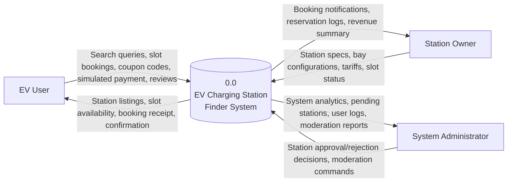
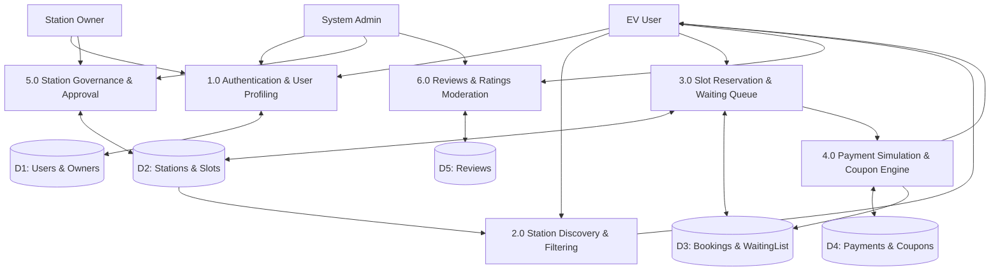
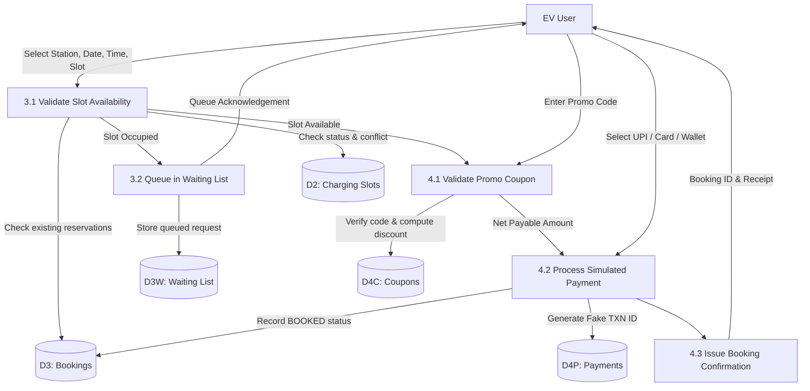
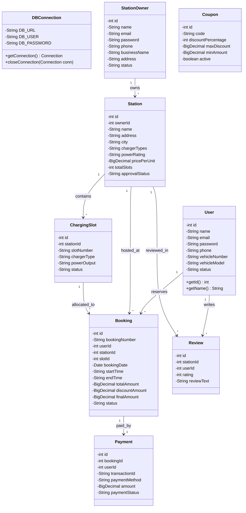
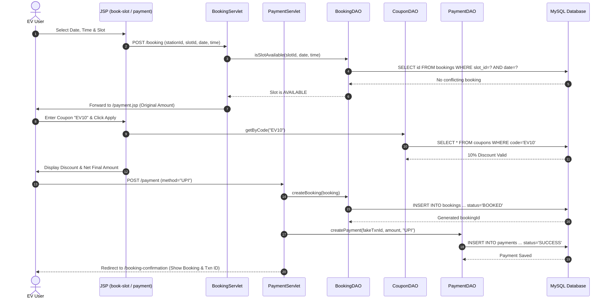
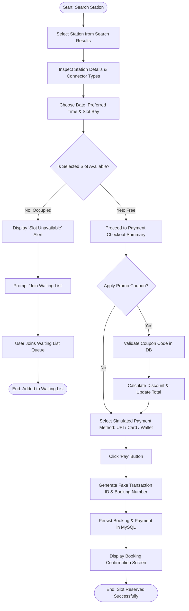
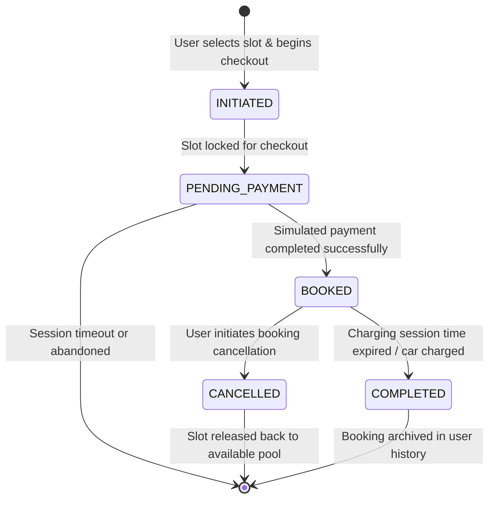
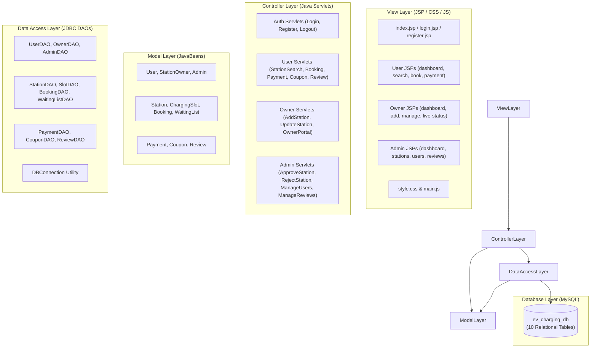
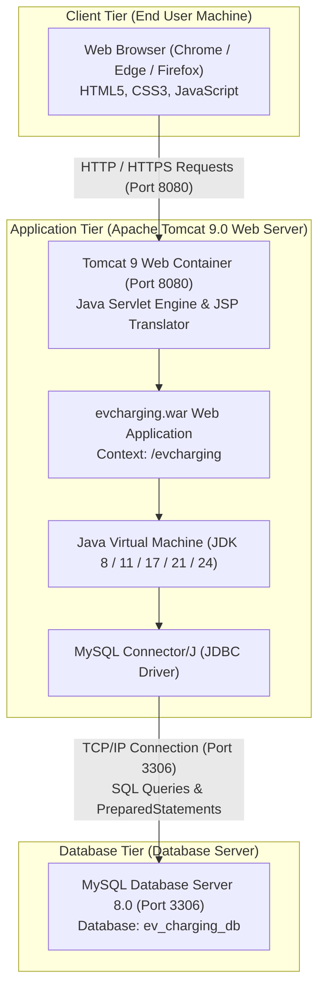

# Software Engineering Diagrams: EV Charging Station Finder System

This document contains standard Software Engineering diagrams formatted in GitHub-compatible **Mermaid** syntax for a 3rd-year CSE project report and presentation.

---

## 1. Use Case Diagram

```mermaid
graph TD
    User["👤 EV User"]
    Owner["🏢 Station Owner"]
    Admin["🛡️ System Admin"]

    subgraph "EV Charging Station Finder System"
        UC1((Register / Login))
        UC2((Search & Filter Stations))
        UC3((View Station & Slot Details))
        UC4((Book Charging Slot))
        UC5((Join Waiting List))
        UC6((Simulated Payment & Apply Coupon))
        UC7((Cancel Booking))
        UC8((Give Rating & Review))

        UC9((Add Charging Station))
        UC10((Update Station & Pricing))
        UC11((Monitor Live Slot Status))
        UC12((View Station Bookings))

        UC13((Approve / Reject Station))
        UC14((Manage Users & Owners))
        UC15((Manage / Delete Reviews))
        UC16((View Dashboard Analytics))
    end

    User --> UC1
    User --> UC2
    User --> UC3
    User --> UC4
    User --> UC5
    User --> UC6
    User --> UC7
    User --> UC8

    Owner --> UC1
    Owner --> UC9
    Owner --> UC10
    Owner --> UC11
    Owner --> UC12

    Admin --> UC1
    Admin --> UC13
    Admin --> UC14
    Admin --> UC15
    Admin --> UC16
```

---

## 2. Data Flow Diagram (DFD Level 0 - Context Level)

---

## 3. Data Flow Diagram (DFD Level 1)

---

## 4. Data Flow Diagram (DFD Level 2 - Reservation & Payment Subsystem)

---

## 5. Class Diagram

---

## 6. Sequence Diagram (Slot Reservation & Simulated Payment)

---

## 7. Activity Diagram (Slot Booking & Waiting List Process)

---

## 8. Statechart Diagram (Booking Lifecycle)

---

## 9. Component Diagram (MVC Architecture)

---

## 10. Deployment Diagram

